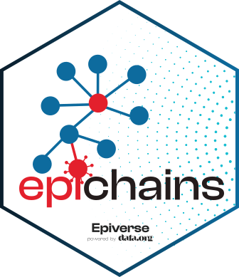
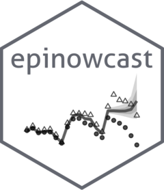
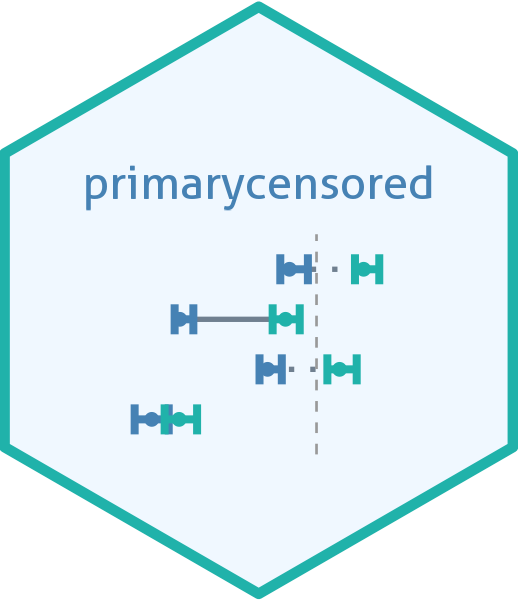

::: {.lead}
I build and maintain open-source R software for outbreak analytics — tools that help epidemiologists analyse transmission, estimate key quantities, and forecast in real time.
:::

Explore all my code on [GitHub](https://github.com/jamesmbaazam). I also review open-source research software for the [Journal of Open Source Software (JOSS)](https://joss.theoj.org/).

## Open source projects I build and contribute to

::: {.grid}

::: {.g-col-12 .g-col-md-6}
::: {.feature-card}
{.card-logo}

::: {.card-head}
[epichains]{.card-title-text} [Lead Author]{.role-badge .role-author}
:::
[Epiverse-TRACE]{.card-community}

Methods for analysing the size and length of infectious disease transmission chains, building on and succeeding [bpmodels](https://github.com/epiverse-trace/bpmodels).

[[Docs](https://epiverse-trace.github.io/epichains/) · [GitHub](https://github.com/epiverse-trace/epichains)]{.card-links}
:::
:::

::: {.g-col-12 .g-col-md-6}
::: {.feature-card}
{.card-logo}

::: {.card-head}
[EpiNow2]{.card-title-text} [Co-maintainer · 2022–2025]{.role-badge .role-past}
:::
[epiforecasts]{.card-community}

Estimates the time-varying reproduction number, growth rate, and doubling time from case data using Bayesian methods.

[[Docs](https://epiforecasts.io/EpiNow2/) · [GitHub](https://github.com/epiforecasts/EpiNow2)]{.card-links}
:::
:::

::: {.g-col-12 .g-col-md-6}
::: {.feature-card}
{.card-logo}

::: {.card-head}
[epinowcast]{.card-title-text} [Contributor]{.role-badge .role-contributor}
:::
[epinowcast]{.card-community}

Flexible, efficient nowcasting to gain situational awareness during outbreaks from incomplete and delayed epidemiological reporting.

[[Docs](https://package.epinowcast.org/) · [GitHub](https://github.com/epinowcast/epinowcast)]{.card-links}
:::
:::

::: {.g-col-12 .g-col-md-6}
::: {.feature-card}
{.card-logo}

::: {.card-head}
[primarycensored]{.card-title-text} [Co-Author]{.role-badge .role-author}
:::
[epinowcast]{.card-community}

Primary event censored distributions for fitting delay and reporting distributions while correctly accounting for censoring and truncation.

[[Docs](https://primarycensored.epinowcast.org) · [GitHub](https://github.com/epinowcast/primarycensored)]{.card-links}
:::
:::

::: {.g-col-12 .g-col-md-6}
::: {.feature-card}
{.card-logo}

::: {.card-head}
[scoringutils]{.card-title-text} [Contributor]{.role-badge .role-contributor}
:::
[epiforecasts]{.card-community}

Tools for scoring and evaluating probabilistic forecasts using proper scoring rules.

[[Docs](https://epiforecasts.io/scoringutils/) · [GitHub](https://github.com/epiforecasts/scoringutils)]{.card-links}
:::
:::

::: {.g-col-12 .g-col-md-6}
::: {.feature-card}
{.card-logo}

::: {.card-head}
[R for Ecologists]{.card-title-text} [Past co-maintainer]{.role-badge .role-past}
:::
[The Carpentries]{.card-community}

Co-maintained the Data Carpentry lesson on *Data Analysis and Visualization in R for Ecologists*.

[[Lesson](https://datacarpentry.org/R-ecology-lesson/) · [GitHub](https://github.com/datacarpentry/R-ecology-lesson)]{.card-links}
:::
:::

:::

## Work with me

::: {.callout-note appearance="simple"}
I'm available for **open-source development**, **code and package review**, and **research software development consulting** for health data science applications.

Get in touch: [Email](mailto:james.m.azam@gmail.com) |
[LinkedIn](https://www.linkedin.com/in/james-azam-phd-6b5b00176/) |
[GitHub](https://github.com/jamesmbaazam)
:::
